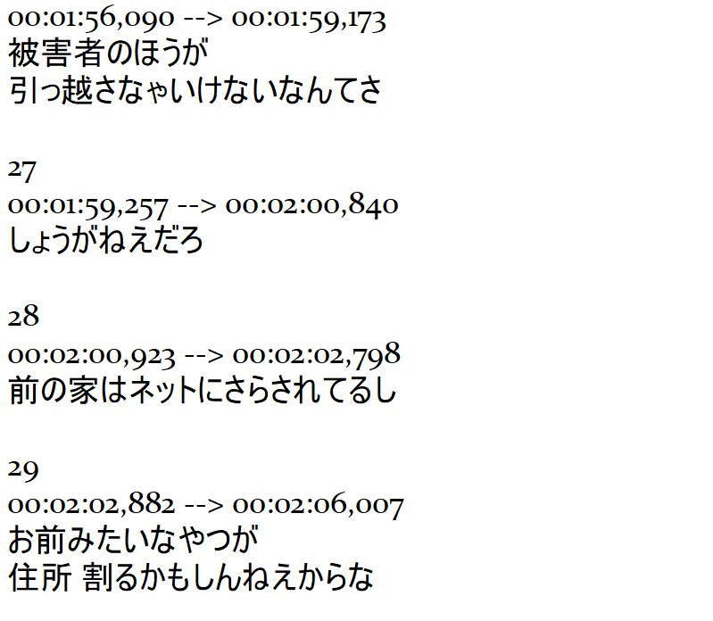
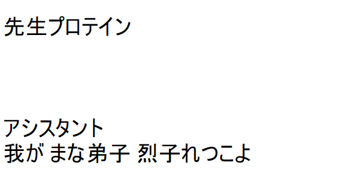
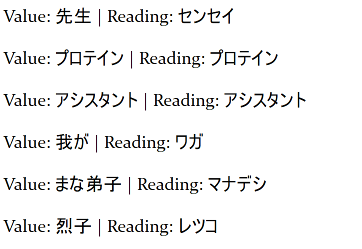

# NihonSentence

NihonSentenceJS is a **Japanese scripts extractor** (hiragana, katakana and kanji) and **word parser** utility. It reads all text files in an input folder and **outputs** the results into corresponding **cleaned + word list files** in an output folder. Please check the **resources** below.

An example usage of this (and why I made it) is to quickly extract all usable sentences from subtitle files for **sentence mining** and/or **creating your own vocabulary flashcards**. See more about this immersion method in the **notes** below.

## Setup/Usage

0. Get some polluted text files that have japanese in them
   _(for example, subtitle files, such as the ones included in the input folder)_



1. Clone the repo:

```bash
git clone https://github.com/SebilleK/NihonSentence.git
```

2. Put your text files in the input folder

3. Install dependencies and run the script

```bash
# cd NihonSentenceJS
npm install
npm start # or node main.js
```

4. Get output!

The clean_example files are cleaned from everything but raw japanese sentences, and the parsed_example files have ALL the words extracted from their corresponding clean_example files.

Use for sentences analyzing or mining


Use for making vocab lists or flashcards


## Resources

- This project uses the "nlp-pattern-match" library for javascript available here:
  https://github.com/azu/nlp-pattern-match

For example usage, you can check out the exampleParser.js file included in the examples folder.

## Notes

- The examples present on the input folder are the Netflix Japanese subtitles for Aggretsuko. I got them from Kitsunekko, which is a good resource for this:
  https://kitsunekko.net/

- Feel free to use these new files for any purpose. I think they are especially useful for analyzing and creating flashcards for essential vocabulary before watching something. Assuming you're familiar with a series, you can:

1. Get subtitle files in japanese for it
2. Parse them all through this
3. Analyze them (maybe with the help of some extension like Rikaikun for Chrome), use them for sentence mining, create vocabulary flashcards from them (with Anki, by hand, ...)

I suggest making an Anki deck with select vocabulary, and then:

4. Study those flashcards
5. Watch the series again

This can be a great method for maximizing your comprehensible input while immersing with a series you like!

Thank you for browsing.
