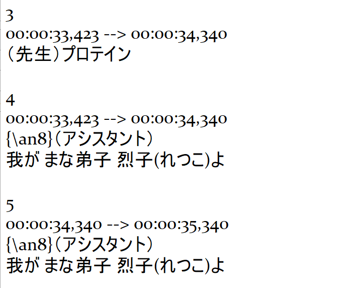

# NihonSentence

NihonSentenceJS is a Japanese scripts extractor (hiragana, katakana and kanji). It reads all text files in an input folder and outputs the results into corresponding files in an output folder.

This can be particulary useful to quickly extract sentences for sentence mining and creating your own vocabulary flashcards from subtitle files. See more at how to use this immersion method in the **notes** below.

## Usage

1. Get some polluted text files that have japanese in them (for example, subtitle files, such as the ones included in the input folder)

2. Clone the repo:

```bash
git clone https://github.com/SebilleK/NihonSentence.git
```

3. Put your text files (such as subtitles) in the input folder

Example (part of input/example1.srt):


4. Run:

```bash
python main.py
```

5. Get output

Example (part of the expected output of example1.srt):


And you get a cleaned up file =)

## Notes

- The examples present on the input folder are the Netflix Japanese subtitles for Aggretsuko. I got them from Kitsunekko, which is a good resource for this:
  https://kitsunekko.net/

- Feel free to use these new files for any purpose. I think they are especially useful for analyzing and creating flashcards for essential vocabulary before watching something. Assuming you're familiar with a series, you can:

1. Get subtitle files in japanese for it
2. Parse them all through this
3. Analyze them (maybe with the help of some extension like Rikaikun for Chrome) and Create Vocabulary flashcards from it (with Anki, by hand, ...)
4. Study those flashcards
5. Watch the series again

This can be a great method for maximizing your comprehensible input while immersing with a series you like!
